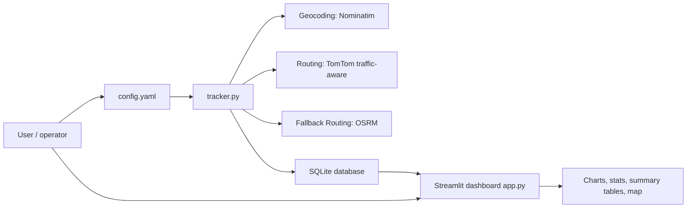
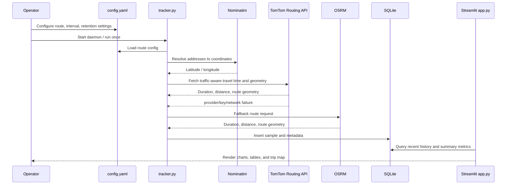
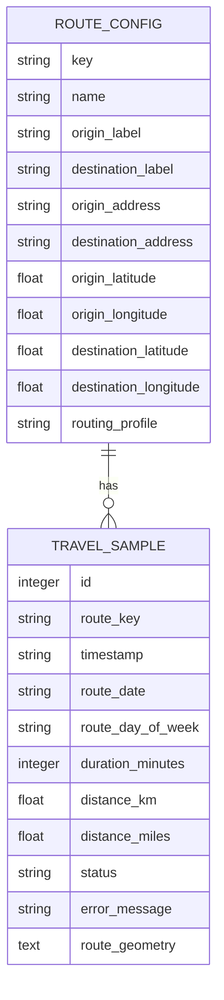
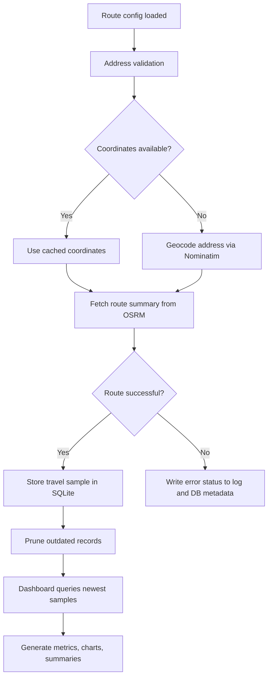

# CommuteMonitor

A local, privacy-conscious commute-monitoring dashboard for tracking travel time between fixed locations over time. The system periodically queries routing services, stores the results in SQLite, and presents the data in a Streamlit dashboard with trend analysis, time-window summaries, and route history.

## Use case

CommuteMonitor is designed for people who want to answer practical questions like:

- How long does my trip usually take during weekday mornings?
- Has my commute changed over the last 7 days, or is it returning to a normal pattern?
- Which days or times are fastest for the same trip?
- Are traffic delays or seasonal variation affecting travel time?
- Do I need to leave earlier or adjust my route strategy based on real historical data?

This is especially useful for commuters, hybrid workers, delivery route planning, household travel monitoring, and anyone tracking repeated trips to a fixed workplace, school, or recurring destination. The app is intentionally local-first: it keeps data on the same machine, avoids external analytics systems, and makes it easier to understand a personal trip pattern without sending travel observations to a remote service.

## What the project does

- Resolves a configured origin and destination from either coordinates or text addresses.
- Uses Nominatim for geocoding and TomTom Routing (traffic-aware, free tier)
    for travel-time estimates, with OSRM fallback.
- Stores commute observations in SQLite for historical analysis.
- Keeps a rolling retention window (default: 7 days) by pruning older records.
- Provides a Streamlit dashboard for route history, charts, summaries, and map views.
- Supports a background collector daemon that polls the route at a configured interval.

## Project layout

```text
CommuteMonitor/
├── app.py
├── config.yaml
├── database.py
├── tracker.py
├── requirements.txt
├── setup.sh
├── shutdown.sh
├── README.md
├── travel_data.db
├── .worker.log
├── .web.log
├── .worker.pid
├── .web.pid
└── logs/
```

## System overview



This architecture keeps the route collection process separate from the user interface. The worker gathers fresh route data in the background while the dashboard reads the same SQLite database for reporting.

## Runtime flow



## Architectural details

### 1. Configuration-driven design

The app uses a YAML configuration file to define runtime behavior and route metadata. This makes the system easy to adjust without changing source code. The configuration includes:

- application port and collection interval
- data retention period
- database path
- route metadata and addresses
- timezone
- user agent information for external services

This configuration is loaded both by the worker and by the dashboard, keeping the app behavior consistent across background collection and UI rendering.

### 2. Background collection worker

The worker is responsible for repeated data acquisition. In its normal mode it runs as a daemon that wakes on a schedule and runs the route collection job. It can also be invoked once for manual collection or debugging.

Operational responsibilities include:

- loading route configuration
- normalizing timestamps into timezone-aware values
- resolving address to coordinates when needed
- querying routing services
- validating the response
- storing data in SQLite
- logging success or failure metadata

### 3. Data persistence layer

The SQLite database keeps all travel samples and summary data. The database layer encapsulates the storage logic so the UI does not need to know transport details.

Typical stored fields include:

- sample timestamp
- date and day-of-week components
- route identifier and labels
- travel time in minutes
- distance in kilometers and miles
- route summary metadata
- geometry or polyline data for map rendering
- collection status, errors, and timestamps for troubleshooting

### 4. UI and analytics layer

The Streamlit app reads from the SQLite database and renders the user-facing dashboard. The dashboard can show:

- route overview
- travel duration history over time
- daily or weekly aggregates
- summary statistics
- current route map
- fastest travel summaries for selected time windows

This split allows for a simple local monitoring workflow where data collection is decoupled from display and analysis.

## Data model



The route definition is intentionally stable; each collected sample records a new observation for that route. This pattern makes it easy to calculate trends, compare times of day, filter by weekday, and identify sharp changes in commute duration.

## Data flow and processing model



## Typical usage patterns

### Personal commute monitoring

Track a daily work or school route to identify delays, average travel time, and how changes in departure time affect arrival.

### Route optimization checks

Compare time values across weekdays or selected windows to decide if a different departure time or alternate route is worth trying.

### Trend analysis

Use the stored history to answer questions like “What is my best commute time this week?” or “Did traffic worsen over the last few days?”

### Local monitoring without cloud dependence

The project is intended to run on a local machine, which makes it useful in home-office or lab-style environments where operational simplicity is more important than enterprise-scale infrastructure.

## Operational notes

- The worker runs as a local daemon and logs to `.worker.log`.
- The Streamlit UI runs separately and logs to `.web.log`.
- Data retention is managed through configuration and cleanup logic rather than a separate database service.
- Public routing and geocoding providers may rate-limit or change behavior. The app should be treated as a lightweight local utility, not a production-grade commercial service.
- TomTom traffic-aware routing requires an API key. Set it in `config.yaml`
    (`tracking.tomtom_api_key`) or as environment variable `TOMTOM_API_KEY`.

## Setup

1. Edit `config.yaml` if you want to change the route, interval, retention window, or port.
2. Run:

```bash
./setup.sh
```

The setup script will:

- verify Python 3.10+
- create `.venv`
- install dependencies
- initialize the SQLite schema
- run an immediate route sample
- start the background collector daemon
- start the Streamlit UI on port `8585`

Open the dashboard at:

```text
http://localhost:8585
```

The Streamlit server binds to `0.0.0.0`, so other devices on the same network can also open `http://<your-machine-ip>:8585`.

## Shutdown

```bash
./shutdown.sh
```

This terminates the worker and the web UI using the saved PID files.

## Configuration

The main settings live in `config.yaml`:

- `app.port`: Streamlit port, default `8585`
- `app.interval_seconds`: collection interval, default `1800`
- `app.retention_days`: rolling analytics window, default `7`
- `app.database_path`: SQLite database file
- `tracking.origin` / `tracking.destination`: route labels, addresses, and optional coordinates
- `tracking.routing_profile`: OSRM profile, default `driving`
- `tracking.user_agent`: required by Nominatim usage policy

If coordinates are omitted, the tracker will geocode the configured address automatically.

## Data model details

Each successful sample stores:

- timestamp
- day of week
- time of day
- duration in minutes
- distance in kilometers and miles
- route summary metadata
- route geometry for map rendering

Failed collections are logged with status metadata so you can troubleshoot network or API issues when they arise.

## Rate limits and API etiquette

Nominatim and OSRM are public services. Keep requests considerate:

- use a descriptive `User-Agent`
- avoid tight polling loops
- prefer cached coordinates in `config.yaml` for long-running use
- do not repeatedly hammer the endpoints when you see timeouts or `429` responses

For production or high-volume deployment, consider a dedicated mapping or routing service rather than the public endpoints.

## Troubleshooting

- If the UI shows no data, wait for the first sample or run `python tracker.py --once`.
- If geocoding fails, verify the address text in `config.yaml` or provide coordinates directly.
- If the worker does not update, inspect `.worker.log`.
- If Streamlit does not appear, inspect `.web.log`.
- If the route map is empty, confirm that OSRM returned geometry for the latest sample.

## Manual commands

Run one sample manually:

```bash
source .venv/bin/activate
python tracker.py --once
```

Run the daemon manually:

```bash
source .venv/bin/activate
python tracker.py --daemon --no-initial
```

Run the UI manually:

```bash
source .venv/bin/activate
streamlit run app.py --server.port 8585 --server.address 127.0.0.1
```

## Indemnification and operational disclaimer

This application is provided as a local utility for personal monitoring and analysis. It is not a managed service and is not guaranteed to be operational, accurate, or suitable for high-reliability transportation or safety-critical decision-making.

By using this project, you agree to indemnify, defend, and hold harmless the project author, maintainers, contributors, and distributors from any and all claims, losses, liabilities, damages, judgments, costs, and expenses arising out of or relating to:

- misuse of the application or data produced by it
- reliance on commute estimates for operational, legal, financial, or safety decisions
- errors, omissions, or data quality issues in geocoding, routing, or local configuration
- third-party service outages, rate limits, incorrect route data, or map provider inaccuracies
- any loss or damage caused by incorrect setup, configuration, or local environment issues

This project uses public mapping and routing services and therefore depends on external data sources that may be unavailable, inaccurate, delayed, or subject to change without notice. Any operational decision based on the output of this system should be independently validated.

This section is intended as a practical risk notice and is not legal advice. If you need a formal legal review, consult a qualified attorney in your jurisdiction.

## License and use limitations

This project is intended for local, personal, educational, and evaluation use. Use it responsibly and according to the terms of the relevant upstream service policies for any geocoding, routing, or map data consumed by the application. Any route planning or operational decision should be based on appropriate local judgment and validated with authoritative sources when required.
